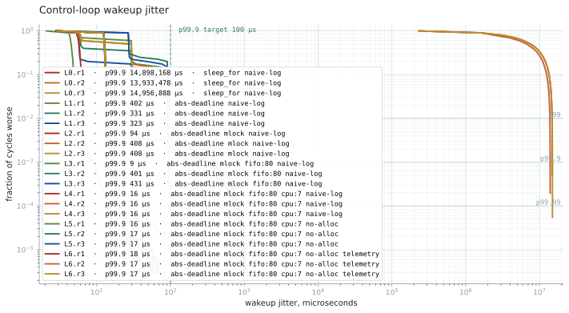

# One-Axis TVC

A hard real-time control and telemetry stack for one-axis thrust
vector control: a 500 Hz C++20 control loop on Linux, measured as a
latency distribution, with a Python ground station, simulation, and
fault injection planned.

## Results



**p99.9 wakeup jitter: 16.5 µs at 500 Hz, worst cycle 86 µs over
2.7 million cycles**, on a stock Ubuntu generic kernel with one core
isolated, its C-states off, and the loop's wakeup timer pinned to it.
**Per-cycle telemetry stays on** and costs 4% at the tail: 17.3
against 16.5 µs at p99.9, zero ring drops.

The naive baseline drifts whole seconds off schedule and cannot see
it in its own measurement. Between it and the headline, two numbers
on the same code: 88.4 µs with C-states left on (v0.1), 7.5 µs with
all sixteen threads polling at 25 W (v0.2a, before the timer was
pinned). Both tails came from the housekeeping cores: nohz_full had
moved the loop's wakeup timer onto them, so their idle exits were the
tail, including the 300 to 500 µs events beyond p99.99 that the
7.5 µs configuration kept. Pinning the timer removes them with two
cores awake, and costs the median: 12.7 µs against 3.6.

Seven mitigations, applied one at a time and each measured in
isolation: [docs/results.md](docs/results.md).

## Status

v0.2a complete: wire codec in C++ and Python against a pinned golden
corpus, SPSC ring with a TSan-verified drop path, drain thread, and
the campaign above. Next: the v0.2b ground station, then the
PREEMPT_RT rematch with the timer pinned. Release plan:
[docs/plan.md](docs/plan.md).

## Layout

```text
src/         control-cycle timing harness (C++20)
scripts/     campaign runner, plotting, regression gate
baselines/   committed campaign data the gate diffs against
tests/       functional and unit tests (container-run for C++)
docker/      dev image for functional builds and tests
docs/        results, methodology, qualification, plan, ADRs, AI log
  results.md         the campaign, level by level
  methodology.md     measurement methodology
  qualification.md   measured platform record
  plan.md            release plan
```

## Build and test

Functional builds and tests run anywhere Docker does:

```bash
docker build -t tvc-dev docker/
docker run --rm -v "$PWD":/w -w /w --cap-add=IPC_LOCK \
  --ulimit memlock=-1:-1 tvc-dev bash tests/ci.sh
```

Measurement campaigns run on bare-metal Linux only. The runner is in
`scripts/`; the platform the numbers were taken on is recorded in
[docs/qualification.md](docs/qualification.md), and how they are
taken in [docs/methodology.md](docs/methodology.md).

## License

See [LICENSE](LICENSE).
