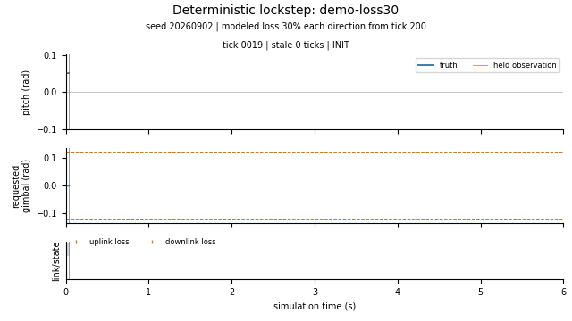

# TVC

TVC simulates pitch control of a thrust-vectored vehicle. A Python physics
model runs against a C++20 vehicle controller over UDP, with scenarios for
communication loss and actuator delay.

The project also includes a 500 Hz Linux timing harness. Its bare-metal
measurements document how scheduling and timer placement affect wakeup
latency.

## How it runs

```text
                      sensor frame
Python simulator  -------------------->  C++ vehicle
plant + actuator  <--------------------  episode policy + PID
                     actuator reply
```

In lockstep, the processes complete one transaction before advancing to the
next tick. Each tick represents 2 ms of simulated time; execution speed
depends on the host. Retries resend cached bytes without advancing the
controller or physics again.

The episode policy handles arming and stale sensor data. Control records
pass through a bounded ring to a separate drain thread. After shutdown,
the runner checks recordings against both processes' reports.

The current model covers one rotational axis. Free-run execution is
measured on the qualified machine (qualified closed-loop timing, below);
ground-station services remain planned.

## Quick start

Use a Bash-compatible shell, Git and Docker with Linux containers. The
development tests cover Linux x86-64 and ARM64. The first build needs
network access to download dependencies.

```bash
git clone https://github.com/mamadou-wane/tvc.git
cd tvc
docker build -t tvc-dev docker/

docker run --rm -v "$PWD":/w -w /w tvc-dev bash -euc '
  cmake -S . -B /tmp/tvc-build -DCMAKE_BUILD_TYPE=RelWithDebInfo
  cmake --build /tmp/tvc-build --target tvc_harness -j2
  python3 -B scripts/run_scenario.py \
    --binary=/tmp/tvc-build/tvc_harness \
    --scenario=S2-gust --seed=1 --loss=0.30 --delay-ticks=1 \
    --out=results/quickstart
'
```

This runs the gust scenario with 30% modeled loss in each direction and
one tick of actuator delay. Both processes run inside the container.

The runner prints a JSON result. `"eligible": true` with `"code": 0` means
the execution and recording checks passed. The vehicle's terminal outcome
is in `results/quickstart/S2-gust.summary.json`.

The same directory contains `S2-gust.sim.csv` and `S2-gust.vehicle.csv`,
along with binary recordings and reconciliation reports. Use a fresh
`--out` directory for another run; existing output is preserved.

## Evidence

### Closed-loop acceptance

The S2-gust campaign covers 10,000 ticks per case, seeds 1 through 200,
30% modeled loss in each direction, and actuator delays of zero or one
tick.

| Implementation | D=0 | D=1 | Total |
|---|---:|---:|---:|
| Python simulator + C++ vehicle | 200/200 | 200/200 | **400/400** |
| In-process Python reference | 200/200 | 200/200 | **400/400** |

Every case passed the five acceptance clauses covering termination, peak
angle, settling, logical cadence and finite values. A complete rebuild
and rerun reproduced all 1,600 canonical artifact files byte-for-byte.
Separate forced-retry tests preserved the four artifacts for their runs.

These results apply to the predeclared synthetic matrix. Reliability
under arbitrary loss sequences remains unmeasured. The Python reference
shares the plant model, so its agreement checks implementation behavior
without independently validating the physics.

[Campaign manifest](tests/golden/lockstep/campaign-v02b.json) ·
[Scenario goldens](tests/golden/lockstep/manifest.json) ·
[Implementation and validation](https://github.com/mamadou-wane/tvc/pull/60)

### Qualified closed-loop timing

The integrated controller's campaign ran on 2026-09-15 on the qualified
bare-metal machine: eight interleaved repeats of L5, L7 and L8, 24 runs of
300,000 cycles at 500 Hz, the free-run L8 closed loop against the
simulator peer on a declared housekeeping CPU. Each figure is a per-run
statistic; the run is the experiment unit.

| Measurement | Result |
|---|---:|
| L8 p99.9 wakeup jitter, median of 8 runs | 18.0 µs |
| L8 minus L7 p99.9 wakeup jitter, median of 8 paired runs | -0.32 µs |
| L8 served sensor-to-actuator latency p99.9, range over 8 runs | 401 to 433 µs |
| L8 served coverage, minimum over 8 runs | 0.99990 |
| L5 regression gate against the 2026-08-29 reference | pass (19.1 vs 16.5 µs, limit 24.8) |

Served latency covers the cycles whose command was computed from a fresh
sensor frame, not every cycle. The L5 reference session disciplined two
CPUs; this session disciplined three. A hard real-time bound has not
been established, and the long-duration free-run episode under loss
that the design described remains unmeasured.

[Campaign findings](docs/results.md#v02b-the-closed-loop-on-the-qualified-machine-tier-3-qualified-timing-evidence) ·
[Compact baseline](baselines/2026-09-15-v02b-campaign/README.md)

### Historical timing-harness measurements

The August 2026 campaign measured the earlier harness with its stand-in
workload on a qualified bare-metal Linux machine.

| Measurement | Result |
|---|---:|
| L5 p99.9 wakeup jitter, telemetry off | 16.5 µs |
| L6 p99.9 wakeup jitter, telemetry on | 17.3 µs |
| Maximum observed wakeup jitter across L4-L6 | 86 µs |
| Measured cycles across L4-L6 | 2.7 million |

The p99.9 values are medians of three run percentiles per level. The
maximum and cycle count cover nine runs. All three telemetry runs
reported zero ring drops.


The investigation traced a major source of delayed wakeups to timer
placement on another CPU. The results above use the recorded pinned-timer
configuration. They describe the historical harness; the integrated
controller's own campaign is the section above. A hard real-time bound
has not been established.

[Campaign findings](docs/results.md#the-pinned-timer-campaign-configuration-of-record) ·
[Measurement definitions](docs/methodology.md) ·
[Platform configuration](docs/qualification.md)

## Demo



One synthetic lockstep run of `demo-loss30`: seed 20260902, with 30%
modeled loss in each direction from tick 200. It ends stabilized.
Regenerate it with Python 3 and Docker using the existing canonical image:

```bash
bash scripts/demo.sh
```

The command checks the vehicle CSV and recordings against the
[scenario manifest](tests/golden/lockstep/manifest.json) before writing
`docs/demo.gif`. Use `--out results/demo-again` for another run.
The GIF illustrates this fixed scenario; it is not timing evidence,
a general loss-tolerance guarantee, or physical vehicle validation.

## Build and verify

Run the development gate using the image built above:

```bash
docker run --rm -v "$PWD":/w -w /w --cap-add=IPC_LOCK \
  --ulimit memlock=-1:-1 tvc-dev bash tests/ci.sh
```

The gate includes component and process tests, sanitizer checks and
historical harness-preservation checks. Hosted CI also runs a separate
canonical job against the frozen numerical environment.

<details>
<summary>Reproduce the canonical checks</summary>

Run from the repository root with Bash, Python 3 and Docker Buildx on the
host. Docker must be able to execute `linux/amd64` containers, natively or
through emulation.

```bash
image='ghcr.io/mamadou-wane/tvc-gold@sha256:77cfe56d943ef87fc8660c8e455127a9fe9fda5f96dc6bc0d804570b96a22d64'
out="$(mktemp -d)"
bash scripts/check_canonical.sh "$image" "$out"
```

This pulls the public image by digest and compares regenerated scenario
outputs with frozen expectations. It includes repeat/retry checks and
small campaign subsets. The complete 400-case campaign is a separate
operation provided by [run_campaign.py](scripts/run_campaign.py).

</details>

## Documentation

- [Measurement methodology](docs/methodology.md): what the timing harness measures and how the machine is prepared.
- [Platform qualification](docs/qualification.md): the measured record of the reference machine.
- [Results](docs/results.md): published timing findings.
- [ADR-001](docs/adr/001-operating-modes.md): why TVC has three operating modes.
- [ADR-002](docs/adr/002-freerun-phase-alignment.md): how the free-run schedule aligns the control delay.
- [Engineering reports](docs/reports/phase-calibration-report.md): the phase-offset calibration of 2026-09-14.

## Repository map

```text
src/         C++ controller, episode policy, transport and timing harness
sim/         Python physics, scenarios and reference/runtime execution
ground/      Python wire codecs and recording readers
scripts/     Process runners, evidence validation and timing tools
tests/       Component tests, fault tests and frozen evidence
docker/      Development and canonical toolchain definitions
baselines/   Historical timing-campaign data
docs/        Methodology, qualification, results, decision records and reports
```

For questions or bug reports, open an
[issue](https://github.com/mamadou-wane/tvc/issues).

## License

See [LICENSE](LICENSE).
