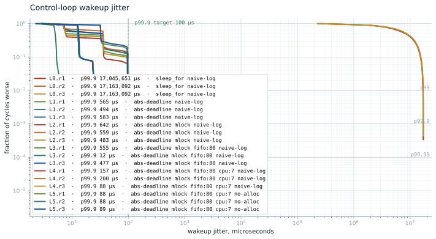

# Campaign results

Six mitigation levels, three repeats of 300,000 cycles each (10 minutes per
run at 500 Hz), on the qualified platform (qualification.md). Every number
below traces to a committed summary in baselines/2026-08-15-campaign-2/,
and the figure regenerates from the committed CSVs:

    python3 scripts/plot_jitter.py --results baselines/2026-08-15-campaign-2

## Headline

p99.9 wakeup jitter of 88.4 microseconds at 500 Hz, reproducible to within
one microsecond across three independent runs (88 to 89 us), on a stock
Ubuntu generic kernel with per-core isolation and power discipline. The
naive baseline does not miss its deadlines by microseconds; it drifts whole
seconds off schedule and cannot see that in its own measurement.

## The table

Wakeup jitter in microseconds, median of three repeats with (min-max)
spread for p99.9. Full percentiles per run live in the committed summaries.

| Level | Adds | p99.9 median (spread) | Worst max |
|---|---|---|---|
| L0 | nothing: sleep_for(period), allocating log | 17,163,092 (17.0M-17.2M) | ceiling |
| L1 | absolute deadlines | 565 (494-583) | 1,108 |
| L2 | mlockall + prefaulted stack and heap | 559 (483-642) | 1,349 |
| L3 | SCHED_FIFO 80 | 477 (12-555) | 1,042 |
| L4 | pinned to the isolated, disciplined core | 157 (88-200) | 993 |
| L5 | allocation-free hot path | 88.4 (88-89) | 994 |

## What each level actually did

**L0 is a correctness failure, not a jitter datapoint.** sleep_for(period)
from "now" drifts by the overshoot every cycle: roughly 57 us per cycle
compounds to 17 seconds behind schedule over ten minutes, saturating the
histogram ceiling (the drop counter caught 1,792 and 11,128 out-of-range
samples in two of the repeats). Meanwhile the naive self-referenced series,
measuring each wakeup against the previous one, reports a p99.9 near 700 us
for the same runs. A harness that measures itself that way would have
called this loop healthy. Absolute deadlines are not an optimization; they
are the difference between a control loop and a metronome sliding off the
song.

**L1 makes the loop correct.** Zero missed deadlines from here on. The
remaining ~565 us tail belongs to the platform: the p99 sits almost exactly
at 100 us in every unpinned run, the signature of roughly one wakeup per
hundred paying a full deep-C-state exit on an undisciplined core.

**L2 is an honest null result.** mlockall plus prefaulting changed nothing
here because nothing was faulting; the mlock status line proves residency
with a post-warm minor-fault recheck of zero. Memory locking is insurance,
and this workload never filed a claim. It stays in the stack because the
flight software will allocate at startup and must not fault later.

**L3 exposes the placement lottery.** Same flags, three runs: p99.9 of
555, 12, and 477 us. The 12 us run landed on CPU 0, which services constant
interrupt traffic and therefore never sleeps deeply; the others landed on
quiet cores that pay C-state exits. A 40x spread controlled entirely by
where the scheduler happened to put the thread is the argument for pinning,
made by the data instead of by assertion.

**L4 removes the lottery.** Pinned to CPU 7 (both SMT siblings isolated at
boot, deep idle disabled on the pair, performance governor and EPP). The
median p99.9 lands at 157 us with the spread still wide (88 to 200); the
first repeats of the pinned levels carry occasional tail events the later
repeats do not, consistent with residual interrupt traffic rather than the
loop itself.

**L5 is the endpoint.** With the allocating log path removed and the
allocation guard set to abort, the loop body runs in 0.3 us at p99.9 and
the wakeup tail settles at 88.4 us, repeat after repeat. The guard proves
the hot path clean at runtime; it is not a code-review claim.

## What is left in the tail

Beyond p99.99 each pinned run keeps roughly thirty events in the 400 to
1,000 us range. Platform qualification bounds the firmware contribution
(two stalls per hour, max 129 us), so these are something else, most
likely interrupts still reaching the isolated pair. They are reported, not
hidden: characterizing them with the osnoise tracer is the natural next
measurement. Until then the honest claim stops at p99.9.

## Regression gate

scripts/bench_gate.py compares a fresh campaign directory against these
baselines and fails when the L5 p99.9 median regresses beyond tolerance:

    python3 scripts/bench_gate.py --results results/<new-dir>

It runs only on the measurement machine. Hosted CI never produces or
judges a timing number; that boundary is the point of the split.

## Provenance

Machine, kernel, topology, isolation, and firmware qualification:
qualification.md. Each summary records its applied config and environment
(governor, EPP, AC state, package temperature) so a run taken under lapsed
discipline identifies itself. Methodology, including why this harness is
coordinated-omission-free by construction: methodology.md.
