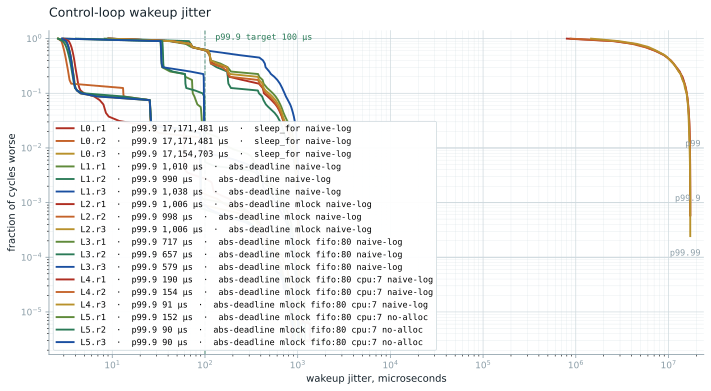
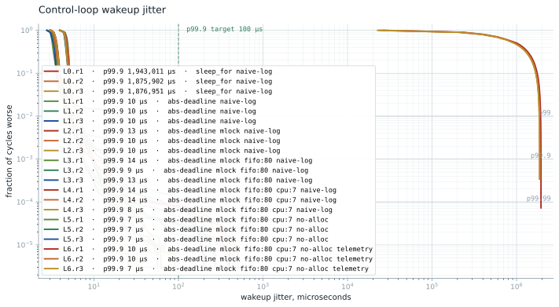

# Campaign results

Six mitigation levels, three repeats of 300,000 cycles each (10 minutes per
run at 500 Hz), on the qualified platform (qualification.md). The
campaigns appear in the order they happened; the configuration of record
since 2026-08-29 is the pinned-timer campaign, its own section below.
Every number in the v0.1 sections traces to a committed summary in
baselines/2026-08-15-campaign-2/, and each figure regenerates from the
committed CSVs:

    python3 scripts/plot_jitter.py --results baselines/2026-08-15-campaign-2

## Headline

p99.9 wakeup jitter of 16.5 microseconds at 500 Hz, worst cycle 86 us
over 2.7 million pinned cycles, on a stock Ubuntu generic kernel with
one core isolated, its idle states off, and the loop's wakeup timer
pinned to it (the pinned-timer campaign below). Two earlier numbers on
the same code: 88.4 us with C-states left on (v0.1), 7.5 us with every
core polling at 25 W (v0.2a). Both were set by the housekeeping cores:
nohz_full had moved the loop's wakeup timer onto them, so their idle
exits were the tail, including the 300 to 500 us events beyond p99.99
that the 7.5 us configuration kept (the far tail section). Pinning the
timer removes them with two cores awake and costs the median, 12.7 us
against 3.6. The naive baseline drifts whole seconds off schedule and
cannot see that in its own measurement.

## The table

Wakeup jitter in microseconds, median of three repeats with (min-max)
spread for p99.9. Full percentiles per run live in the committed summaries.

| Level | Adds | p99.9 median (spread) | Worst max |
|---|---|---|---|
| L0 | nothing: sleep_for(period), allocating log | 17,163,092 (17.0M-17.2M) | ceiling |
| L1 | absolute deadlines | 565 (494-583) | 1,108 |
| L2 | mlockall + prefaulted stack and heap | 559 (483-642) | 1,349 |
| L3 | SCHED_FIFO 80 | 477 (12-555) | 1,042 |
| L4 | pinned to the isolated, disciplined core | 157 (88-200) | 993 |
| L5 | allocation-free hot path | 88.4 (88-89) | 994 |

## What each level actually did

**L0 is a correctness failure before it is a jitter number.** sleep_for(period)
from "now" drifts by the overshoot every cycle: roughly 57 us per cycle
compounds to 17 seconds behind schedule over ten minutes, saturating the
histogram ceiling (the drop counter caught 1,792 and 11,128 out-of-range
samples in two of the repeats). Meanwhile the naive self-referenced series,
measuring each wakeup against the previous one, reports a p99.9 near 700 us
for the same runs. A harness that measures itself that way would have
called this loop healthy. Absolute deadlines are what separate a control
loop from a metronome sliding off the song.

**L1 makes the loop correct.** Zero missed deadlines from here on. The
remaining ~565 us tail belongs to the platform: the p99 sits almost exactly
at 100 us in every unpinned run, the signature of roughly one wakeup per
hundred paying a full deep-C-state exit on an undisciplined core.

**L2 is an honest null result.** mlockall plus prefaulting changed nothing
here because nothing was faulting; the mlock status line proves residency
with a post-warm minor-fault recheck of zero. It stays in the stack because
the flight software will allocate at startup and must not fault later.

**L3 exposes the placement lottery.** Same flags, three runs: p99.9 of
555, 12, and 477 us. The 12 us run landed on CPU 0, which services constant
interrupt traffic and therefore never sleeps deeply; the others landed on
quiet cores that pay C-state exits. A 40x spread controlled entirely by
where the scheduler put the thread is the argument for pinning.

**L4 removes the lottery.** Pinned to CPU 7 (both SMT siblings isolated at
boot, deep idle disabled on the pair, performance governor and EPP). The
median p99.9 lands at 157 us with the spread still wide (88 to 200); the
first repeats of the pinned levels carry occasional tail events the later
repeats do not, consistent with residual interrupt traffic rather than the
loop itself.

**L5 is the endpoint.** With the allocating log path removed and the
allocation guard set to abort, the loop body runs in 0.3 us at p99.9 and
the wakeup tail settles at 88.4 us, repeat after repeat. The guard proves
the hot path clean at runtime.

## What is left in the tail

Beyond p99.99 each pinned run keeps roughly thirty events in the 400 to
1,000 us range. Platform qualification bounds the firmware contribution
(two stalls per hour, max 129 us), so these are something else, most
likely interrupts still reaching the isolated pair. Characterizing them
with the osnoise tracer is the next measurement. Until then the honest
claim stops at p99.9.

Resolved on 2026-08-29: they arrived through a migrated wakeup timer,
not through interrupts on the pair. See the far tail section below.

## Kernel comparison: generic vs PREEMPT_RT

From 26.04 the PREEMPT_RT kernel ships free in the archive, version-matched
to generic. Same machine, same discipline, same binary; the kernel is the
only variable. Full RT data: baselines/2026-08-15-rt-campaign.

Medians of three repeats, microseconds; (spread) on p99.9; worst max across
repeats.

| Level | Kernel | p50 | p99.9 (spread) | p99.99 | Worst max |
|---|---|---|---|---|---|
| L1 | generic | 35.4 | 565 (494-583) | 946 | 1,108 |
| L1 | PREEMPT_RT | 112.8 | 1,010 (990-1038) | 1,048 | 2,193 |
| L4 | generic | 12.8 | 157 (88-200) | 586 | 993 |
| L4 | PREEMPT_RT | 3.5 | 154 (91-190) | 619 | 968 |
| L5 | generic | 12.8 | 88.4 (88-89) | 492 | 994 |
| L5 | PREEMPT_RT | 3.5 | 90.5 (90-152) | 539 | 987 |

Three findings. First, PREEMPT_RT cut the pinned loop's median wakeup
latency 3.7x (12.8 to 3.5 us): its wakeup path for a FIFO task is simply
leaner. Second, at p99.9 the kernels tie within spread (88.4 vs 90.5), so
for this isolated, disciplined, pinned workload the generic kernel already
delivers the RT kernel's tail. Third, the population beyond p99.99
survived both kernels unchanged, which narrows its suspect list: threading
every IRQ handler changed nothing, so those events are likely
non-preemptible work such as IPIs, TLB shootdowns, or the residual tick.
The osnoise tracer is the next step and now has a sharper question.
The osnoise pass of 2026-08-29 found none of the three: the wakeup
timer was on another CPU (the far tail section below).

The cost side is equally clear: unpinned SCHED_OTHER runs roughly doubled
(L1 p50 35 to 113 us, p99.9 565 to 1,010) and L1 dropped one deadline in
900,000 cycles. PREEMPT_RT buys determinism for RT threads and charges
everything else for it. The conclusion for this project: PREEMPT_RT is the
tool when isolation is unavailable; with isolation and power discipline,
the generic kernel holds the same p99.9. The baselines and the regression
gate stay on the generic kernel, the configuration of record.

One pattern held across every campaign on both kernels: the first repeat
of each pinned level carries the widest tail (L5 first repeats of 237, and
152 us against later repeats near 88). Recorded as an open observation for
the osnoise pass.

v0.2a caveat: this comparison ran with C-states enabled, and the v0.2a
campaign below showed C-state exits set the 88 us p99.9 floor on this
machine. Both kernels were paying the same power-management cost, so the
tie says the kernels tie under that discipline. Whether they still tie
with the wakeup timer pinned to the isolated core is the rematch
question (the far tail section below).

## v0.2a: telemetry at no measured cost, and the C-state floor

v0.2a added the telemetry path: a 56-byte record per cycle through a
single-producer single-consumer ring, drained by a SCHED_OTHER thread
off the isolated core into a CRC-checked recording file (record
layout: the schema string and hash in src/telemetry.hpp, the decoder
in ground/wire.py, the committed corpus and manifest under
tests/golden/, and the compatibility tests tests/unit/test_wire.py and
tests/cpp/wire_tests.cpp). The acceptance
question: does enabling it move the jitter CDF? Campaign of 2026-08-16,
seven levels, three repeats of 300,000 cycles, same protocol as v0.1;
L6 is L5 plus --telemetry. Data:
baselines/2026-08-16-telemetry-campaign and
baselines/2026-08-16-l5l6-repeats.

    python3 scripts/plot_jitter.py --results baselines/2026-08-16-telemetry-campaign

| Level | Adds | p99.9 median (spread) | Worst max |
|---|---|---|---|
| L0 | nothing: sleep_for(period), allocating log | 1,876,951 (1.88M-1.94M) | 1,946,157 |
| L1 | absolute deadlines | 9.6 (9.6-9.8) | 222 |
| L2 | mlockall + prefaulted stack and heap | 10.0 (9.7-12.8) | 107 |
| L3 | SCHED_FIFO 80 | 13.5 (9.4-13.5) | 713 |
| L4 | pinned to the isolated core | 13.9 (7.6-14.4) | 535 |
| L5 | allocation-free hot path | 7.5 (7.4-7.5) | 471 |
| L6 | telemetry ring + drain thread | 9.6 (7.2-10.4) | 408 |

### The C-state floor

These numbers sit 12x below the v0.1 table, and the code did not
change. The discipline did: this campaign disabled every cpuidle state
on every CPU (cpupower idle-set -D 0) before running. The idle driver
on this machine advertises C2 at 18 us exit latency and C3 at 350 us;
with all states disabled, the tail that sat near 100 us at p99 and
88 us at p99.9 in v0.1 collapses to 8 to 14 us. The v0.1 headline was a
measurement of C-state exit latency. Even L0's drift shrank
9x, because the sleep_for overshoot that compounds it is itself mostly
C-state exit. The pinned levels paid that exit on a housekeeping CPU,
not on the isolated core: the far tail section below.

The provenance system could not see this. Each summary records
governor, EPP, AC state, and package temperature, and every one of
those fields is identical between the 88.4 us runs and the 7.5 us runs.
Each summary's env block now carries per-state cpuidle disable counts
across all CPUs. The 2026-08-16 baselines predate the field, so for
them the discipline of record stays the command output captured in
qualification.md.

### Telemetry cost: three repeats said yes, eight said no

The planned check (L6 p99.9 median within 10 percent of L5, three
repeats each) failed: 9.6 vs 7.5 us, +28 percent. Five more repeats of
each level under the same discipline
(baselines/2026-08-16-l5l6-repeats) reversed the sign: L5 median 9.7,
L6 median 8.4. Runs of both configurations intermittently carry a
run-scale mode, a few hundred cycles landing in the 10 to 35 us band;
one L5 repeat put its whole p99 at 13.6 us with no telemetry in the
build, and one L6 repeat put p99.9 at 35.4 us with a normal p99. That
mode owns the tail at this floor, and which arm it visits is luck.

Pooled over all eight runs per arm, 2.4 million cycles each:

| | L5 | L6 |
|---|---|---|
| pooled p99.9 | 13.72 us | 13.67 us |
| cycles above 10 us | 5,381 | 4,021 |
| cycles above 50 us | 132 | 105 |
| cycles above 200 us | 53 | 44 |

The CDF is unchanged within run-to-run variation: 48 nanoseconds of
difference at pooled p99.9, and no threshold where the telemetry arm
systematically exceeds the quiet one. A rank test across the sixteen
per-run p99.9 values agrees (Mann-Whitney U, p = 0.44). The 3-repeat
median check was the wrong instrument at this floor; the v0.2b check
will interleave the two arms within one campaign and judge pooled
exceedance counts, so run-scale environment noise cancels instead of
deciding the verdict.

The recording side held its contract in every run: 305,000 records per
run, zero ring drops across all eight telemetry runs, every recording
decoding CRC-clean at the byte-exact expected size.

### What is left in the tail, revisited

The 300 to 700 us events beyond p99.99 survived C-state disabling in
both arms, which removes deep idle exits from their suspect list; they
had already survived PREEMPT_RT (above). What remains is
non-preemptible work: IPIs, TLB shootdowns, or the residual tick. The
osnoise tracer now has a question sharpened from two directions. The
recordings already contribute: each carries a per-cycle tick stamp, and
decoding the 35.4 us repeat's recording places its 383 cycles above
20 us across the full ten minutes (ticks 87 to 300,940), so that run's
elevated tail was a sustained state across the whole window. Whatever
visited the machine stayed for the run. All three suspects are cleared
in the far tail section below.

### Incidents, recorded

Two discipline mistakes from this campaign, kept because the next
campaign inherits them. First, the initial launch wrapped sweep.py in
taskset -c 7, which would have pinned the unpinned levels to the
isolated core and confined the drain thread's inherited affinity mask
to it; caught from the console output before any data was used, and
rerun without it. A sweep preflight that compares the inherited mask
against /sys/devices/system/cpu/isolated is the guard to add. Second,
the IRQ affinity mask written during setup (ffff3f) carries bits for
CPUs 16 to 23 on a 16-CPU machine; the kernel rejected it with
EOVERFLOW and the per-IRQ loop suppressed the errors, so IRQ affinity
was likely never applied. The correct exclude-6,7 mask is ff3f. The
numbers above were measured without it.

## The far tail: timer migration, not the isolated core

Session of 2026-08-29 on the same machine, kernel 7.0.0-30-generic (an
apt upgrade had replaced the 7.0.0-29 images; qualification.md). The
osnoise tracer ran on CPU 7 with its own workload disabled
(NO_OSNOISE_WORKLOAD) and the trace clock set to mono, so every
interrupt, softirq, NMI, and thread that touched the core is stamped
in the clock the recording uses for each cycle's deadline and wake.
IRQ affinity was applied for the first time (mask ff3f; the 2026-08-16
write had failed, see incidents above). Data:
baselines/2026-08-29-timer-migration/, one directory per run, osnoise
reports next to the summaries, the two analysis scripts under tools/,
and session-observations.txt for the console captures (turbostat,
/proc/timer_list, the refused IRQ list, temperatures) that no summary
carries.

Wakeup jitter in microseconds. L5 except the osnoise runs, which are
L6 because the recording is what ties a trace event to the cycle it
hit.

| Run | Cycles | Idle states off on | timer_migration | p50 | p99 | p99.9 | p99.99 | max |
|---|---|---|---|---|---|---|---|---|
| cpuidle-before | 15k | no CPU | 1 | 421.9 | 943.1 | 1,155.1 | 1,225.7 | 1,241 |
| cpuidle-after | 15k | all 16 CPUs | 1 | 12.9 | 14.0 | 16.4 | 21.4 | 32 |
| cpuidle-pair | 15k | CPUs 6, 7 | 1 | 13.8 | 86.1 | 169.5 | 447.7 | 937 |
| osnoise-A-pair | 15k | CPUs 6, 7 | 1 | 13.8 | 84.9 | 85.3 | 85.8 | 98 |
| timerdiag-mig1 | 15k | CPUs 6, 7 | 1 | 12.9 | 25.5 | 380.4 | 635.4 | 894 |
| timerdiag-mig0 | 15k | CPUs 6, 7 | 0 | 12.7 | 14.1 | 16.6 | 24.2 | 27 |
| osnoise-B-all | 60k | all 16 CPUs | 1 | 4.3 | 15.1 | 16.2 | 70.1 | 233 |
| osnoise-C-mig0 | 300k | CPUs 6, 7 | 0 | 13.9 | 15.3 | 21.8 | 27.9 | 78 |

The first two rows are the cpuidle acceptance check the campaign
called for: the env block's per-state disable counts read 0 before
cpupower idle-set -D 0 and 16 after, on all four states, and the same
L5 loop moved from p99.9 1,155 us to 16.4.

### What the tracer saw

CPU 7 never sleeps in any run but cpuidle-before: its idle states are
disabled, and turbostat shows CPUs 6 and 7 at 4.56 GHz with Busy% 99.9
under the pair discipline (session-observations.txt). The tail still
moves with what the other fourteen CPUs are allowed to do:
cpuidle-pair against cpuidle-after, nothing on CPU 7 changed, p99.99
447.7 against 21.4 us and max 937 against 32. In osnoise-A-pair, 374
of 15,000 cycles woke more than 50 us late, clustered at 84 to 85 us,
and none of them is covered by kernel-visible noise: tail-report.txt
lists every noise event in every window, and nothing in any window
reaches half the lateness (the local-timer handler in those windows
runs 0.3 to 1.2 us; the run's worst local-timer handler, 40 us, and
worst TIMER softirq, 132 us, fall outside them). In osnoise-B-all,
with every CPU polling, CPU 7's local timer fired 93 times across
60,000 cycles.

The wakeup timer is not reliably on CPU 7. clock_nanosleep arms an
unpinned hrtimer. With nohz_full, timer migration moves unpinned
timers off the CPU that armed them (get_target_base to
get_nohz_timer_target); nohz_full removes CPU 7 from the timer
housekeeping set, isolcpus leaves it with no scheduler domain to
search, so the target is whatever housekeeping_any_cpu returns at
each arming. /proc/timer_list sampled six times during timerdiag-mig1
caught the loop's hrtimer_wakeup three times: on CPU 4, CPU 4, and
CPU 7 (session-observations.txt). The single-variable test is
timerdiag-mig1 against timerdiag-mig0: same discipline, minutes apart,
only /proc/sys/kernel/timer_migration changed, p99.9 380 against
16.6 us and max 894 against 27. With the timer on a housekeeping CPU
the loop's wake latency is that CPU's idle-exit latency, and the
quantum follows the state it was in: 84 to 87 us in osnoise-A-pair,
cpuidle-pair, and every v0.1 L5 run (p99 87.2 in all three repeats of
baselines/2026-08-15-campaign-2), 380 to 900 us in timerdiag-mig1.

The local-timer counts on CPU 7 fit that reading but do not prove it
on their own. With the timer pinned they run two per cycle (607,732
over 300,000 cycles in osnoise-C-mig0). With migration on they depend
on where the timer went: 93 over 60,000 cycles in osnoise-B-all, 69,490
over 15,000 in osnoise-A-pair. The kernel keeps a migrating timer on
the arming CPU when the target has no earlier event to piggyback on
(switch_hrtimer_base); a polling idle CPU keeps its tick and always
has one, a sleeping one stops it and mostly does not. So in
osnoise-B-all the timer left CPU 7 on nearly every cycle, and in
osnoise-A-pair it stayed for most cycles and left for a minority, the
2.5 percent that woke 85 us late. That last sentence is a reading of
the kernel source, not a measurement.

This reinterprets the sections above. The v0.1 floor of 88.4 us was a
housekeeping CPU's idle exit reaching the loop through a migrated
timer, and the 300 to 1,000 us events beyond p99.99 were the same path
from a deeper state. The v0.2a discipline, every idle state off on
every CPU, worked because it kept every housekeeping CPU awake, not
because of anything on the isolated core. On 7.0.0-30 that discipline
means sixteen threads busy-polling: turbostat read Busy% 100 on every
core at 4,211 MHz and 24.96 W package power, and k10temp read 92 C
once during the session (session-observations.txt; 68 to 71 C during
the two-minute osnoise-B-all, temp-during.txt). osnoise-B-all still
carried six cycles of 100 to 232 us, none covered by noise in its
window: the timer was still migrated, and whatever delays a
housekeeping CPU is invisible from CPU 7.

The three suspects named above are cleared by measurement. The tick
is not it: tick_stop events on CPU 7 number five in osnoise-A-pair
(two stops, three held by RCU), none in osnoise-B-all, two in
osnoise-C-mig0 (both held by RCU), and the local-timer handler runs
0.87 us at the median and 40 us at worst (tick-stop.txt and
tail-report.txt per run; /proc/timer_list read .tick_stopped: 1 for
CPU 7 while idle after osnoise-A-pair). IPIs to CPU 7 during the
ten-minute run: three, two nohz_full_kick and one resched. TLB
shootdowns: none.

### The ten-minute run

osnoise-C-mig0: L6, 300,000 cycles, idle states off on CPUs 6 and 7
only, timer_migration=0, package 68 C at the start and 69 C at the end
(run.log).

    p50 13.9   p99 15.3   p99.9 21.8   p99.99 27.9   max 78.4 us
    0 missed deadlines, 0 ring drops, 305,000 records, 0 CRC errors

Twelve cycles woke more than 30 us late (tail-report.txt, threshold
30). Five are covered by a long local-timer handler on CPU 7, the
hrtimer expiry itself running 19 to 35 us; the other seven have no
kernel-visible cause and top out at 52 us. The worst cycle of the run,
78 us, is under the qualified firmware stall of 129 us.

### What this changes, and what it costs

Against the v0.2a headline the pinned-timer discipline gives up the
median and p99.9 (13.9 and 21.8 us against 3.5 and 7.5) and buys the
tail (max 78 against 308 to 498 across the eight v0.2a L5 runs) at two
polling cores instead of sixteen. The median is not explained by the
discipline alone: the two all-CPU runs, same configuration, read p50
4.3 (osnoise-B-all) and 12.9 (cpuidle-after). The p99 gap is
confounded: osnoise-B-all runs the v0.2a idle discipline on 7.0.0-30
with the tracer live and the IRQ mask applied and reads p99 15.1
against an L6 median of 5.3 on 7.0.0-29; kernel version, tracer, and
mask were not separated. timer_migration is a machine-wide sysctl:
with it at 0 every CPU keeps and services its own timers and idle
consolidation stops for the whole machine; the cost of that on the
housekeeping side was not measured. The full campaign under
timer_migration=0 ran the same afternoon (the next section) and made
the pinned-timer discipline the configuration of record.

Open after this session: timer_migration was not in the env block, the
same provenance gap the cpuidle field closed; it is now the block's
last key (0 or 1, -1 where the sysctl is unreadable), so a run with a
migrated timer identifies itself. The 20 to 35 us hrtimer expiry on
CPU 7 is now the largest kernel-visible event on the core. Two NVMe
queues have kernel-managed affinity on CPUs 6 and 7 (qualification.md),
silent in every run here, and need isolcpus=domain,managed_irq,6,7 at
the next reboot.

## The pinned-timer campaign: configuration of record

Campaign of 2026-08-29, 12:51 to 16:26, seven levels, three repeats of
300,000 cycles, commit 0fafb7c, kernel 7.0.0-30-generic, discipline as
qualification.md records it: performance governor and EPP, IRQ mask
ff3f, idle states off on CPUs 6 and 7 only, timer_migration=0, booted
with isolcpus=domain,managed_irq,6,7. Every summary's env block reads
timer_migration 0 and eight disabled idle states. Package temperature
67 to 69 C for the whole 3.6 hours (temp-during.txt). Data:
baselines/2026-08-29-pinned-timer-campaign.

    python3 scripts/plot_jitter.py --results baselines/2026-08-29-pinned-timer-campaign

Wakeup jitter in microseconds, median of three repeats with (min-max)
spread; the v0.2a column is that campaign's p99.9 median for the same
level.

| Level | Adds | p50 | p99 | p99.9 (spread) | p99.99 | Worst max | v0.2a p99.9 |
|---|---|---|---|---|---|---|---|
| L0 | nothing: sleep_for(period), allocating log | 7.5 s | 14.8 s | 14.9 s | 14.9 s | 15.0 s | 1.9 s |
| L1 | absolute deadlines | 6.1 | 93.9 | 331 (323-402) | 782 | 1,077 | 9.6 |
| L2 | mlockall + prefaulted stack and heap | 29.2 | 94.0 | 408 (94-408) | 828 | 1,080 | 10.0 |
| L3 | SCHED_FIFO 80 | 27.2 | 91.5 | 401 (9-431) | 707 | 1,029 | 13.5 |
| L4 | pinned to the isolated core | 12.7 | 13.6 | 16.4 (16.0-16.5) | 19.7 | 72 | 13.9 |
| L5 | allocation-free hot path | 12.7 | 13.6 | 16.5 (16.4-16.8) | 19.5 | 86 | 7.5 |
| L6 | telemetry ring + drain thread | 12.7 | 13.7 | 17.3 (16.7-17.6) | 20.0 | 83 | 9.6 |

### The pinned levels

Nine runs, 2.7 million cycles: p99.9 between 16.0 and 17.6 us, p99.99
under 21, worst cycle 86 us, zero missed deadlines, zero ring drops.
The sixteen pinned runs of v0.2a spread 7.2 to 35.4 at p99.9 with
maxes of 27 to 524 us. The far tail is gone from the campaign, not
from one run. Interrupts that reached CPU 7 in 3.6 hours: 9
reschedule, 8 function-call, 36 irq-work, and the local timer; the two
NVMe queues with managed affinity on the pair delivered none
(irq-delta.txt).

The telemetry arm reads 0.7 us above the quiet arm at p99.9 (17.3
against 16.5, 4 percent), inside the 10 percent criterion the v0.2a
plan set, and the first campaign in which the two arms separate at all
(L5 repeats 16.4 to 16.8, L6 repeats 16.7 to 17.6).

### The unpinned levels

L1 to L3 got worse than v0.2a, and that is the discipline, not noise.
An unpinned thread runs on a housekeeping CPU, and under this
discipline those CPUs sleep, so roughly one wake per hundred pays its
own C-state exit: p99 near 94 us, the 85 us quantum from the far tail
section measured from the other side. L0's drift went back to 15 seconds for
the same reason (1.9 s under v0.2a, when every core was polling). The
ladder's big step moves to L4, 400 to 16 us: on this machine, pinning
to the disciplined core is the mitigation, and the levels before it
only set up for it. L3.r1 at 8.6 us is the placement lottery from v0.1
(12 to 555 us then), one repeat in three landing somewhere quiet.

### What it costs

Against v0.2a the record gives up the median (12.7 against 3.6 us at
L5) and p99.9 (16.5 against 7.5) and buys p99.99 (19.5 against 23),
the max (86 against 471), run-to-run reproducibility (spread 0.4
against 0.1 us at L5, but 16.0 to 17.6 across all nine pinned runs
against 7.2 to 35.4), and power (two cores polling instead of sixteen,
67 to 69 C against 25 W and a 92 C excursion). The median gap is the
wake path: a local hrtimer interrupt on the isolated core against a
remote wake noticed by a polling core without one. Why the local path
costs 12.7 us is not measured.

The regression gate moves to this campaign: baseline L5 p99.9 16.5 us,
tolerance 50 percent (limit 24.8). A run with timer migration on reads
85 to 400 and fails; a run with the pair's idle states on pays CPU 7's
own C-state exits and fails; the 7.5 us configuration passes, as it
should, since it is a legitimate discipline with a stated cost.

## Regression gate

scripts/bench_gate.py compares a fresh campaign directory against the
committed baselines (as of 2026-08-29:
baselines/2026-08-29-pinned-timer-campaign, L5 p99.9 median 16.5 us)
and fails when the L5 p99.9 median regresses beyond tolerance. The
default tolerance is 50 percent (limit 24.8 us): identical-config
repeats spread 16.4 to 16.8, a run with timer migration on reads 85 to
400 us, and a run with the pair's idle states enabled pays CPU 7's own
C-state exits, so a lapse in either half of the discipline fails far
past the limit. The v0.2a baselines stay committed under
baselines/2026-08-16-telemetry-campaign for the comparison above:

    python3 scripts/bench_gate.py --results results/<new-dir>

It runs only on the measurement machine. Hosted CI never produces or
judges a timing number; that boundary is the point of the split.

## Provenance

Machine, kernel, topology, isolation, and firmware qualification:
qualification.md. Each summary records its applied config and environment
(governor, EPP, AC state, package temperature, cpuidle disable counts,
timer_migration) so a run taken under lapsed discipline identifies
itself. Methodology,
including why this harness is coordinated-omission-free by construction:
methodology.md.
